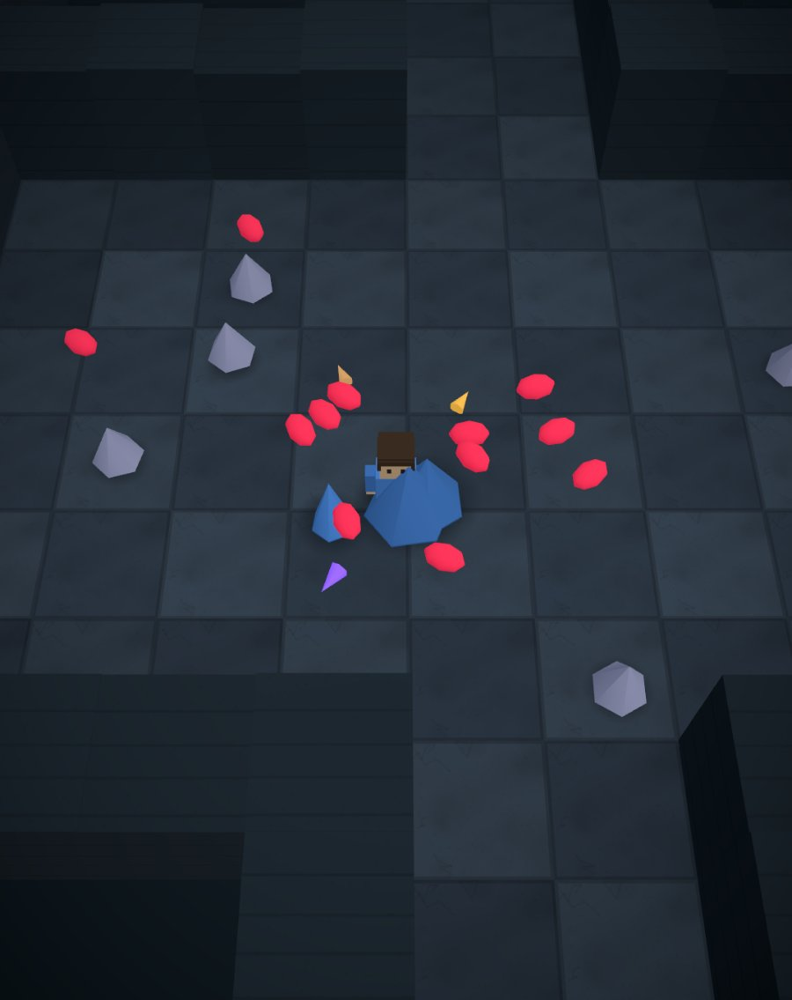
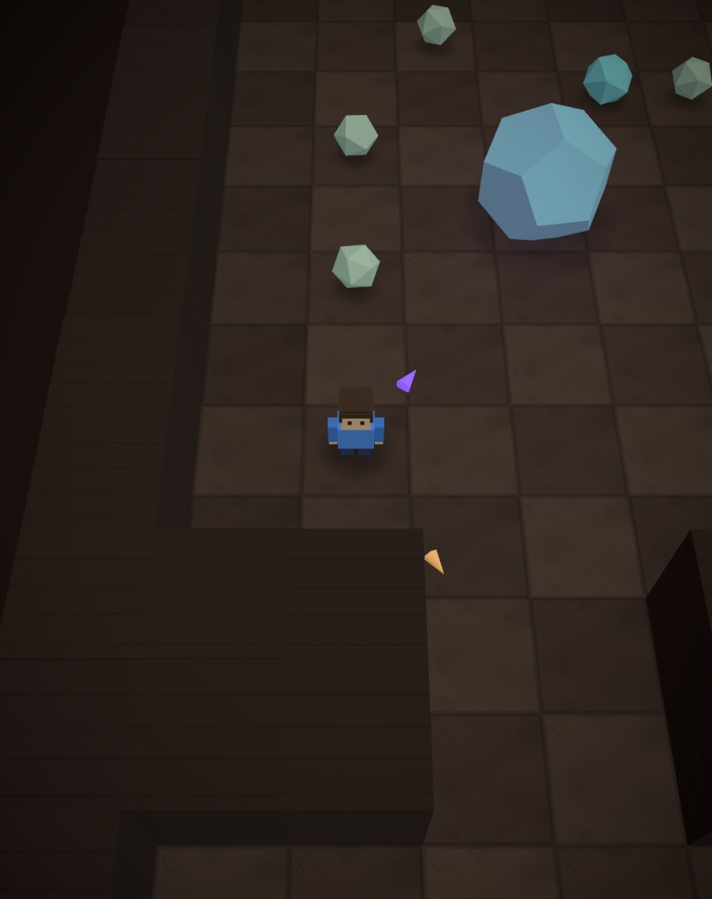
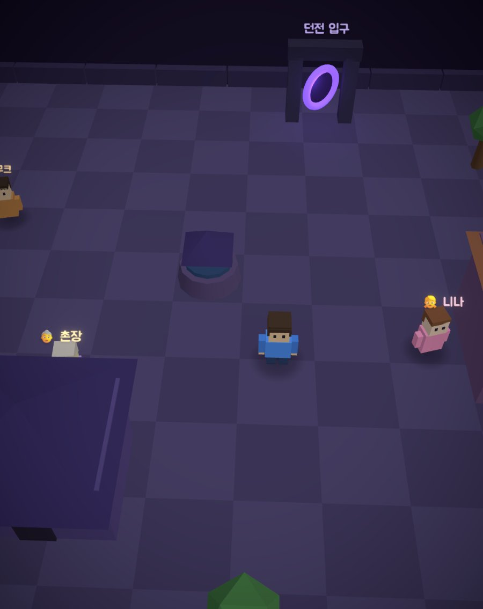
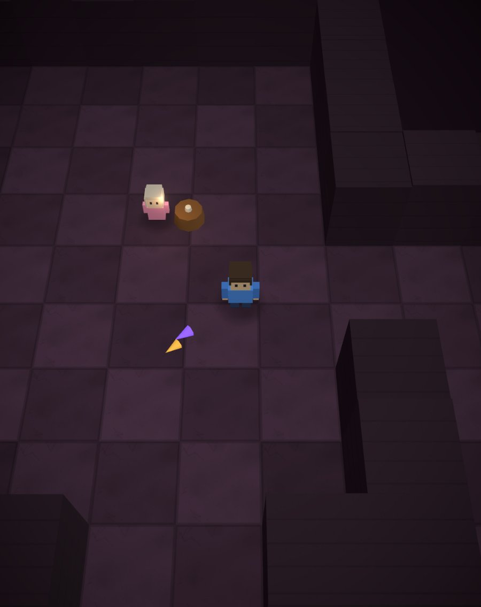

# 백층 던전 (Dungeon 100) — 게임 소개 및 설명 문서

> NAN 2026 (NHN Game × AI Hackathon) 사전과제 제출물 3
> 제출자: 김학현 (개인 참여)

## 1. 게임 제목 및 한 줄 소개

**백층 던전 (Dungeon 100)** — 책 속으로 떨어진 대학생이 집으로 돌아가기 위해, 매판 새로 생성되는 던전을 100층까지 내려가는 3D 로그라이크.

## 2. 게임 개요

- **스토리**: 2026년의 대학생이 『백층 던전의 비밀』을 읽다 잠들고, 눈을 떠 보니 책 속 마을. 돈도 힘도 없는 주인공이 할 수 있는 것은 던전 탐험뿐 — 100층 끝의 '집으로 가는 문'을 향해 내려갑니다. 층을 내려갈 때마다 벽의 글귀가, 보물을 얻을 때마다 잊고 있던 집의 기억이 이 세계의 비밀을 조금씩 드러냅니다.
- **절차 생성 로그라이크**: 모든 층의 방·복도·적·보물이 시드 기반으로 새로 생성됩니다. 죽으면 처음부터 — 하지만 매판 다른 맵, 다른 빌드.
- **두 문 달리기 (자매작 통합)**: 보물상자에 닿으면 자매작 [두 문 러너](https://hakhyun-kim.github.io/door-runner/)의 게임플레이가 미니게임으로 등장 — 트랙을 달리며 정답이 적힌 문을 몸으로 통과해야만 아이템을 얻습니다. 두 문 러너를 별도로 실행할 필요 없이 이 게임 안에 통합되어 있습니다. 문을 통과할 때마다 "더 달릴까?"를 선택하는 푸시-유어-럭 구조로, 3연속 문을 완주하면 전설의 보물을 얻습니다.
- **던전 3종**: 던전 입구에서 선택 — 🎒 초등학교 던전(쉬운 산수) / 🧠 어른 던전(암산 훈련) / 👹 몬스터 던전(수학 대신 전투 — 보물상자가 몬스터 아레나로 바뀌어, 몰려오는 무리를 뚫고 보석 3개를 주우면 같은 보상).
- **걸어다니는 3D 마을과 시간의 흐름**: 던전 입장 전·5층마다·부활 시 옛날 RPG처럼 마을을 직접 걸어다니며 NPC와 대화합니다. 처치 코인으로 대장간 영구 강화(죽어도 유지), 5층 단위 마을 방문 = 부활 체크포인트. 깊이 내려갈수록 마을 풍경과 대사도 변합니다(가을 → 몬스터 습격 → 방벽 → 폐허와 새벽) — 던전도 10층마다 색이 바뀌고 안개가 짙어집니다.
- **엔딩까지 완결된 스토리**: 10층마다 보스 "페이지의 수호자", 56층의 수수께끼 소녀(복선 4개 회수), 100층 황금 문의 선택 엔딩 2종 + 10년 후 에필로그.
- 모바일 우선 웹앱 (React + three.js). 사운드는 Web Audio 합성(파일 없음), 그래픽은 절차 생성.

## 3. 게임 방법

### 목표
층마다 보라색 포털을 찾아 아래로, 아래로 — 100층 끝의 '집으로 가는 문'을 향해 최대한 깊이 내려가는 것.

### 조작
| 상황 | 모바일 | 데스크톱 (키보드) |
|------|--------|--------|
| 던전 이동 | 화면 아무 곳이나 드래그 (가상 스틱) | `WASD` / 방향키 |
| 공격 | 자동 (가까운 적 자동 조준) | 자동 |
| 두 문 달리기 | 화면 왼쪽/오른쪽 꾹 | `←`/`→` 또는 `A`/`D` |

### 규칙
- 적을 처치하며 탐험, 층 클리어 시 보상 카드 3택 1로 빌드를 쌓습니다 (공격력·연사·멀티샷·이속·체력·사거리).
- 보물상자 = 미니게임: 수학 던전은 두 문 달리기(정답 문 통과 수만큼 아이템, 오답 충돌 시 빈손), 몬스터 던전은 몬스터 아레나(보석 3개 줍기, 전용 체력으로 무한 재도전).
- 처치 코인은 죽어도 유지 — 마을 대장간에서 영구 강화(공격·생명·신속, 무한 단련)를 구매합니다.
- 5층마다 마을로 가는 문이 나타나 주민들이 회복·아이템·힌트를 주고, 들를 때마다 부활 지점이 그 층으로 갱신됩니다.
- 10층마다 보스가 포털을 봉인하고, 그 외 층은 수문장 정예가 문 앞을 지킵니다. 깊이 내려갈수록 몬스터·던전 색이 바뀌고 안개가 짙어집니다.

### 종료 조건
체력이 0이 되면 게임오버 — 도달 층수와 최고 기록이 표시되고, 마지막으로 다녀온 마을(체크포인트)에서 장비를 유지한 채 부활해 재도전합니다. 100층 황금 문에 닿으면 엔딩입니다.

## 4. 실행 방법

### 웹 (권장 — 설치 불필요)
아래 링크를 브라우저(모바일/PC)에서 열면 바로 플레이됩니다.

> **플레이 링크: https://hakhyun-kim.github.io/dungeon100/**
> **자동 시연 링크 (클릭 한 번, 약 100초): https://hakhyun-kim.github.io/dungeon100/?demo** — 게임이 스스로 마을·촌장 대화·전투·미니게임 2종·층 테마·56층의 소녀·보스를 자막과 함께 시연합니다.

별도 로그인·설치·유료 라이선스가 필요 없습니다. (사운드는 첫 터치 후 재생됩니다)

### 로컬 실행 (소스 코드)
```bash
git clone https://github.com/Hakhyun-Kim/dungeon100.git
cd dungeon100
npm install
npm run dev   # http://localhost:5175
```
요구 사항: Node.js 20 이상.

## 5. 플레이 영상

> **YouTube: https://youtu.be/V4Vr0z4m6uE** (30~60초 실플레이 영상)

## 6. 기술 요약

| 항목 | 내용 |
|------|------|
| 렌더링 | three.js + @react-three/fiber — 지형·적·투사체·파티클 전부 InstancedMesh |
| 그래픽 연출 | 블룸·비네트 포스트프로세싱(@react-three/postprocessing) + 블롭 섀도우 + 가짜 AO(인스턴스 색) + 캔버스 절차 생성 돌결 텍스처 — 이미지 파일 0개 |
| 캐릭터 | 박스 지오메트리 절차 생성 (후드티·책가방 대학생 주인공, 팔다리 스윙 걷기 애니메이션) |
| 절차 생성 | 시드 고정(mulberry32) 던전·문제·보상 — 같은 층 번호는 같은 구조 (재현성) |
| 프레임워크 | React 18 + TypeScript + Vite |
| 텍스트 렌더링 | 한글 → 캔버스 → 텍스처 (폰트 파일 없음) |
| 사운드 | Web Audio API 실시간 합성 효과음 20종 + 절차 생성 BGM 5트랙 (오디오 파일 없음) |
| 데이터 | 백엔드 없음 — localStorage (최고 기록, 되찾은 기억, 설정) |
| 배포 | GitHub Actions → GitHub Pages 자동 배포 |

## 7. 스크린샷

| 던전 전투 | 보스전 | 걸어다니는 마을 | 56층의 소녀 |
|---|---|---|---|
|  |  |  |  |
